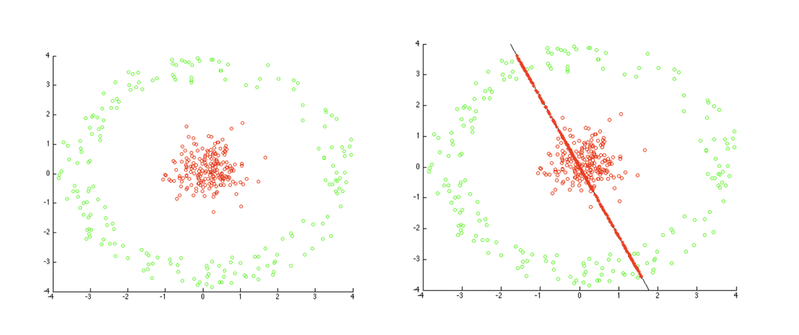

```{r setup, include=FALSE}
knitr::opts_chunk$set(echo = TRUE, fig.width=30, fig.height=30)
```

## Exploratory Data Analysis

Do an exploratory data analysis of a matrix of expression values. The data consists of expression values for samples that were treated with DMSO and TSA. The samples were measured using three technologies: bulk, IFC96, IFC800. See the two RDS files `counts.RDS` and `phenodata.RDS`


## Data Import
```{r }
x = readRDS("counts.RDS")
anno = readRDS("phenodata.RDS")
head(anno)
```


## Compute and visualize basic statistics

How many replicates are there for each combination of factor levels?
```{r }
unique_tech<-unique(anno$Technology)
unique_treat<-unique(anno$Treatment)
row<-length(unique_tech)
col<-length(unique_treat)
frequency_table<-matrix(0,nrow = row, ncol = col)
rownames(frequency_table)<-unique_tech
colnames(frequency_table)<-unique_treat

n=length(anno$Treatment)
for (i in 1:n){
  frequency_table[anno$Technology[i],anno$Treatment[i]]=frequency_table[anno$Technology[i],anno$Treatment[i]]+1
}
frequency_table
```

How many genes have an expression value above 0 in each sample?
x>0 converts matrix to a matrix with same dimension but values of entries is 0 or 1
colSums: sum over the columns (sum over each samples). does sum over columns for all columns. it gives a row vector
genes_above_zero: a vector that has as many as components as there are for columns

```{r }
#x>0 converts matrix to a matrix with same dimension but values of entries is 0 or 1
#colSums: sum over the columns (sum over each samples). does sum over for a given column and you do that for all columns. 
#colSums gives a row vector
#genes_above_zero: a vector that has as many as components as there are for columns

genes_above_zero = colSums(x > 0)
head(genes_above_zero)
```


## Normalize the data
Scale the columns so that the total sum of all columns are identical

scale= centers and scales.
centering: subtract the average from every column every column is 0 centered. didnt want to do this
scale:should pass a vector which has same elements as there are columns. x has 86 columns. this vector should have 86 elements
      colSums(x) gives a vector contains as many cols as there are in cols in x. each column is going to be divided by sum of each columns

```{r }
# Multiply by a million to better separate 0 from the other values
x_scaled = scale(x, center = FALSE, scale = colSums(x)*1e-6)

head(colSums(x_scaled))
```


## Transform the data to log-scale

Use the function `log1p` to transform the data to log-scale
log1p=log(1+x) to prevent crash of log0
```{r }
x_log = log1p(x_scaled)
```


## Visualize the distribution of the expression values

This is pre-processing step for violin plots and box plots
```{r}
# prepare the data-frame and the colors for each plot
x_data_frame<-as.data.frame(x_log)
ncol=ncol(x_data_frame)
nrow=nrow(x_data_frame)
# x_color contains color information for each sample
x_color<-vector(mode="character", length=ncol)

for (i in 1:ncol){
  treat<-anno[i,1]
  tech<-anno[i,2]
  if (treat=="DMSO"&& tech=="bulk"){
    x_color[i]<-"DMSO+bulk"
  }
  
  else if (treat=="TSA"&& tech=="bulk"){
    x_color[i]<-"TSA+bulk"
  }
  
  else if (treat=="DMSO"&& tech=="IFC96"){
    x_color[i]<-"DMSO+IFC96"
  }
  
  else if (treat=="TSA"&& tech=="IFC96"){
    x_color[i]<-"TSA+IFC96"
  }
  
  else if (treat=="DMSO"&& tech=="IFC800"){
    x_color[i]<-"DMSO+IFC800"
  }
  
  else if (treat=="TSA"&& tech=="IFC800"){
    x_color[i]<-"TSA+IFC800"
  }
  
  else{
    x_color[i]<-"unknown"
  }
  
}

```

Use violin plots to visualize the distribution of the expression values
Group and color by experimental factors.
```{r}
library(ggplot2)
#assign a new variable
flat_expressions<-x_log
#setting dimension of flat_X to NULL means it transforms to a single vector. (flattening the gene expression into one long vector)
dim(flat_expressions)<-NULL
# Create a vector of sample names, to be used as factor
# If you use "each" parameter it works like this:1 is repeated nrow times, 2 repeated nrow times,......6 repeated nrow times etc until 86
flat_names<-rep(1:ncol, each=nrow)
flat_colors<-rep(x_color, each=nrow)

# Create the flat data frame. put those three columns into one dataframe.
# x_flat_data_frame has three columns. 1st col=flat_names(sample name) 2nd col=flat_expression(gene expression)  
# 3rd col=flat_colors(color)
x_flat_data_frame<-data.frame(flat_expressions, flat_names, flat_colors)
names(x_flat_data_frame)<-c("gene_expression", "sample_name", "color")

# Create a simple violin plot
# aes defines what you should have in x and y.
# x is sample name. you have to transform 1~86 to factor.
# take all y values that correspond to same x and make 1 violin.
p<-ggplot(x_flat_data_frame, aes(x=factor(x_flat_data_frame$sample_name), y=x_flat_data_frame$gene_expression, fill=x_flat_data_frame$color))
p+geom_violin()


```

To make violin plot more visible, I will just use first few samples.
```{r}

flat_expressions_reduced<-x_log[,1:6]

dim(flat_expressions_reduced)<-NULL
flat_names_reduced<-rep(1:6, each=nrow)
flat_colors_reduced<-rep(x_color[1:6], each=nrow)

x_flat_df_reduced<-data.frame(flat_expressions_reduced, flat_names_reduced, flat_colors_reduced)
names(x_flat_df_reduced)<-c("gene_expression", "sample_name", "color")

p<-ggplot(x_flat_df_reduced, aes(x=factor(x_flat_df_reduced$sample_name), y=x_flat_df_reduced$gene_expression, fill=x_flat_df_reduced$color))
p+geom_violin()
```
use boxplots to visualize the distribution of the expression values
Group and color by experimental factors.
```{r }
# Prepare the data for the boxplot

#x_at for box plot. it tells me at which line exactly a particular box plot should be drawn.
#x_at is a vector 1~86

x_at = 1:ncol
x_names = paste("s", 1:ncol)
# Box plot
boxplot(x_data_frame,
        main="gene expression",
        at=x_at,
        # at is defining position fo plot appears
        xlab="normalized expression",
        names=x_names,
        las=2,
        border=factor(x_color),
        horizontal=TRUE)

```
To make box plot more visible, I will just use first few samples.
```{r }

# Box plot
#x_data_frame[1:6] this selects first 6 columns(variables)
boxplot(x_data_frame[1:15],
        
        main = "Gene expression",
        
        #at is defining position fo plot appears
        # 1st plot appeas 1st position, 2nd plot appears in 4th position......
        at = c(1,4,2,5,3,6,8,9,7,11,10,12,14,13,15),
        xlab = "normalized expression",
        names = x_names[1:15],
        las = 2,
        border = factor(x_color[1:15]),
        horizontal = TRUE
)


```


## Most variable genes

Identify the 500 most variable genes (with largest variance across samples) and continue working with those.
```{r }
# Calculate the indexes of x, ordered according to the variance
# apply is a function that applies a certain function to either all columns or all rows of the dataframe.
# 1 means->apply to the rows
# 2 means_> apply to columns
# function->var is the function you want to apply
# calculates variance of each row
x_variance<-apply(x_data_frame, 1, var)
# order returns the vector of indices of ordered vector.
# na.last=T means if they are not assigned values they end up beind at the end
# decreasing=T from biggest to smallest
row_indexes<-order(x_variance, na.last=TRUE, decreasing=TRUE)
#head(row_indexes)
# Select the genes with the highest variance
# to select 500 points 
x_top_500<-head(x_data_frame[row_indexes,],500)
head(x_top_500)
```


## Sample correlations
Compute and visualize the sample-to-sample correlations
```{r}
#prepare the data
x_top_500_corr<-x_top_500

#name sample so that it can output easily
#names is gonna name variables (in the dataframe it is column)
names(x_top_500_corr)<-1:ncol

# Compute the correlation between columns
#cor calculates correlation between variables of the data frame.(upper traingle)
correlation<-cor(x_top_500_corr)

# Visualize it using corrplot
# install.packages("corrplot")
library(corrplot)
# plot correlation. used default setting
# sample against sample
# sample is ordered by hclust
corrplot(correlation, type="upper", order="hclust", tl.col="black", tl.srt=45)


```


## Clustering
Compute and visualize a hierarchical clustering of the samples, use package `hclust`
```{r}
#prepare data
x_top_500_cluster<-x_top_500
#hclust uses dissimilarity structure.
#dist(t(x_top_500)) t is transposition. dist computes distance between rows. you want distance between samples. so had to transpose so that samples appears in the rows.
#p is power p=2 is euclidean

names(x_top_500_cluster)<-1:ncol
#compute distance matrix
dissimilarity_matrix<-dist(t(x_top_500_cluster), method="euclidean", diag=FALSE, upper=FALSE, p=2)
# Create and plot the cluster
cluster<-hclust(dissimilarity_matrix, method="complete", members=NULL)
plot(cluster)

```


## Heatmap
Use the package `pheatmap` to generate a heatmap of the expression data.
```{r}
# install.packages(pheatmap)
library(pheatmap)

#prepare the data
x_top_500_heat<-x_top_500
#names know that it will give names to columns(variables)
names(x_top_500_heat)<-1:ncol
row.names(x_top_500_heat)<-1:500
#computes heat map of dataframe (relationship between different samples) this shows hclust and heatmap
#x-axis is sample and y-axis gene (observation).
pheatmap(x_top_500_heat)

```


## PCA

In the exercise session, we saw a potential case where the normal PCA can be misleading. 

```{r fig.align="center", out.width = "650px", echo=FALSE}

```

* Generate the data on the left, plot it as a scatter plot and color the points based on their class label.
```{r}
#constants to control the points
num_points=200
set.seed(6)

# generate the center points with 3 dimensions
# runif generates a vector of random numbers between 0 and 1

center_angles<-runif(num_points)*2*pi
center_x<- 5* runif(num_points)*cos(center_angles)
center_y<-3* runif(num_points)*sin(center_angles)
center_z<-1* runif(num_points)
center_class<-rep(1,times=num_points)


# generate the border points with 3 dimensions

border_angles<-runif(num_points)*2*pi
border_x<-(10+5*runif(num_points))*cos(border_angles)
border_y<-(7+3*runif(num_points))*sin(border_angles)
border_z<-(4+1*runif(num_points))*cos(border_angles)
border_class<-rep(2, times=num_points)
# generate the full data frame.
# pca_data have 3 columns. first half of 2nd column is center_class_x, 2nd half of 2nd column is border class_x
data<-data.frame(c(center_x, border_x), c(center_y, border_y), c(center_z, border_z), c(center_class, border_class))
names(data)<-c("x","y","z", "class")

# Plot the data, coloring them based on the class
# color is a list of 2elments but indexed by by class column of data.
plot(data$x,data$y, col=c("red","blue")[data$class])

```
* Do the PCA, plot the variance explained by the principal components. Select $k$ such that you explain $80\%$ of the variance in your data. 
```{r}
#compute and view the pareto plot of the pca
pca<-prcomp(data, center=TRUE, scale=TRUE)
summary(pca)
#calculates standard deviation associated every single principal component
#pca.var contains variance explained by each principal component
pca.var<-pca$sdev^2
qcc::pareto.chart(pca.var)
#in this case you need to choose 3 out of 4 principal components to explain over 80%
```
Select $k$ such that you explain $80\%$ of the variance in your data. 
```{r}
#select k=3 to explain at least 80% of the variance
k=3
# projection onto the lower dimension(=k dimension)
# scale function does "mean centering" and "multiplies each column by certain scale"
# you scale data such that pca$center is the mean of each column and every column is multiplied by this pca$scale
# pca$rotation are eigen vectors and then you selected first k columns (k eigen vectors)
# %*% makes matrix multiplication. 
# data is the original data.this is not centered and scaled.
# but pca is done in mean centered and scaled data. so you need to scale data again
projected_points<- as.data.frame (scale(data, pca$center, pca$scale)%*%pca$rotation[,1:k])
#add additional column (class)
projected_points$class<-data$class
# v1 projection of all the points along the first principal components
names(projected_points)<-c("v1", "v2", "v3", "class")
head(projected_points)
#col=c("red","green")[pca_projected$class] if class=1 then this outputs red. if class=2 outputs green 
plot(projected_points[,1], projected_points[,2], col=c("red", "blue")[projected_points$class])
```


* Explain why this problem happens. 

problem: Before pca data was well separated by class,but after pca, the data is less separable even if you used prinipal components that explained above 80% variance (98%).This problem happened because this data is not linearly separable but pca works in the data that is linearly separable. So we use kernel to tackle this issue

* Try to solve the problem with your desired method and do the PCA
```{r}
#pca works in the data that is linearly separable. So use kernel
#data is original data. using 3rd column (z axis), 4th column(class). you are not changing these two columns

kernelized_data<-as.data.frame(data[c(3:4)])

#generated two columns ( r and a )
#r= reduced (distance of each point from origin)
kernelized_data$r<-(data$x^2+data$y^2)^0.5

#a=angle of points (angle or rotation between x-axis and points)
#atan=arc tan=inverse of tangent=gives you this angle
kernelized_data$a<-atan(data$y/data$x)
head(kernelized_data)
#you have transformed data (kernelized data) into non-linear space so that when you use pca later it is linearly separable.
plot(kernelized_data$r, kernelized_data$a, col=c("red", "blue")[kernelized_data$class])
```

* and plot the variance explained by your PCs.
```{r}
kernel_pca<-prcomp(kernelized_data, center=TRUE, scale=TRUE)
kernel_pca_var<-kernel_pca$sdev^2
qcc::pareto.chart(kernel_pca_var)
```


* Select $k$ in order to explain $80\%$ of the variance in your data. 

```{r}
#select k=3 to explain at least 80% of the variance
k=3

projected_kernel_points<-as.data.frame(scale(kernelized_data, center=kernel_pca$center,scale=kernel_pca$scale)%*%kernel_pca$rotation[,1:k])
projected_kernel_points$class<-kernelized_data$class
names(projected_kernel_points)<-c("V1", "V2", "V3", "class")

plot(projected_kernel_points$V1, projected_kernel_points$V2, col=c("red", "blue")[projected_kernel_points$class])

```

* Is the $k$ different in comparison to the previous case?

In this case no. Both methods had to use 3 out of 4 PCs to explain at least 80%.
But even in this case, kernel pca can separate points according to class with k=1 or k=2. (example shown below)
Also in my opinion using kernel pca can lead to smaller k.

```{r}
#select k=1 to show kernel pca can separate points using even 1 pc
k=1
projected_kernel_points_reduced<-as.data.frame(scale(kernelized_data,  center=kernel_pca$center,scale=kernel_pca$scale)%*%kernel_pca$rotation[,1:k])

projected_kernel_points_reduced$class<-kernelized_data$class
names(projected_kernel_points_reduced)<-c("V1", "class")

#1:400 is an artificial axis. the only PC is y axis
plot(1:400, projected_kernel_points_reduced$V1, col=c("red", "blue")[projected_kernel_points$class])


```


